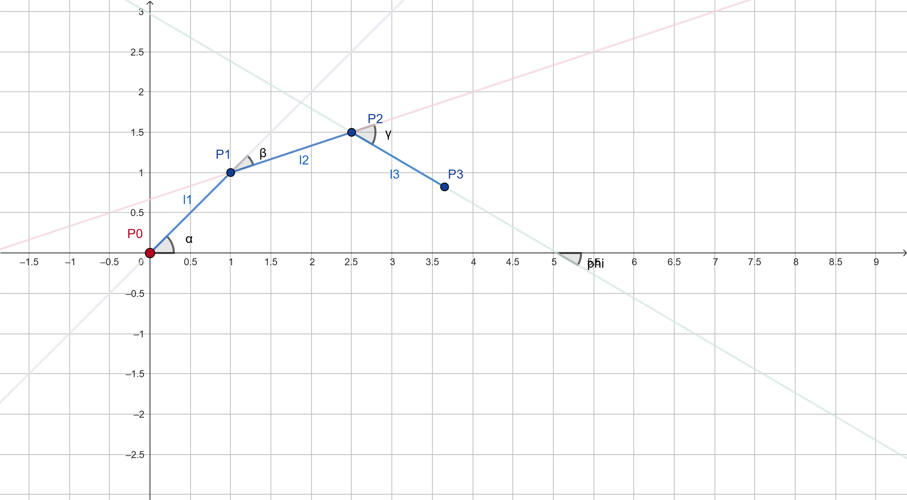

# 3-DOF Robotic Arm Inverse/forward kinematics Toolkit



A comprehensive Python toolkit for simulating and controlling a 3-degree-of-freedom robotic arm with interactive visualization and inverse kinematics solving.

## Overview

This project consists of two complementary programs that provide a complete robotic arm simulation experience:

1. **Forward Kinematics Simulator** - Interactive control of joint angles to see arm movement
2. **Inverse Kinematics Solver** - Calculate joint angles needed to reach specific positions

## Features

### Forward Kinematics Simulator
- **Real-time visualization** of 3-DOF robotic arm
- **Interactive sliders** for each joint angle (-180° to +180°)
- **Live end-effector tracking** with position and orientation display
- **Workspace visualization** with grid reference
- **Reset functionality** to return to home position

### Inverse Kinematics Solver
- **Target position input** via text boxes (px, py coordinates)
- **Orientation control** (phi angle) for end-effector
- **Automatic joint angle calculation** using analytical methods
- **Workspace boundary visualization** with reachability feedback
- **Real-time error handling** for unreachable positions
- **Visual target indicators** with orientation arrows

## Requirements

```bash
pip install matplotlib numpy
```

**Required Python packages:**
- `matplotlib` (for interactive GUI and plotting)
- `numpy` (for mathematical operations)
- `math` (built-in Python module)

## Getting Started

### 1. Forward Kinematics Simulator

Run the forward kinematics simulator to explore how joint angles affect arm position:

```bash
python "Interactive 3-DOF Robotic Arm Simulator.py"
```

**How to use:**
- Use the **three sliders** at the bottom to control joint angles:
  - **α (Alpha)**: First joint angle - rotates the entire arm
  - **β (Beta)**: Second joint angle - bends the elbow
  - **γ (Gamma)**: Third joint angle - rotates the end-effector
- Watch the arm move in **real-time** as you adjust sliders
- The **title displays** current end-effector position and total distance
- Click **"Reset Arm"** to return all joints to 0°

### 2. Inverse Kinematics Solver

Run the inverse kinematics solver to find joint angles for specific targets:

```bash
python "Interactive Inverse Kinematics Solver for 3-DOF Robotic Arm.py"
```

**How to use:**
- **Enter target values** in the input boxes:
  - **Target X**: Desired X-coordinate (cm)
  - **Target Y**: Desired Y-coordinate (cm)  
  - **Orient. φ**: Desired end-effector orientation (degrees)
- **Click "Calculate"** to solve and update the visualization
- The **orange square** shows your target position
- The **orange arrow** indicates the desired orientation
- **Joint angles** are displayed in the info panel on the right

## Configuration

Both programs can be easily customized by modifying the configuration section at the top:

```python
# Base position (coordinate system origin)
x0 = 0   # Base X-coordinate (cm)
y0 = 0   # Base Y-coordinate (cm)

# Link lengths (modify for different arm configurations)
l1 = 12  # First link length (cm)
l2 = 12  # Second link length (cm) 
l3 = 12  # Third link length (cm)
```

## Arm Specifications

- **3 Degrees of Freedom** (3-DOF)
- **Equal link lengths**: 12 cm each (configurable)
- **Total reach**: 36 cm when fully extended
- **Base position**: Fixed at origin (0,0) by default
- **Coordinate system**: Standard Cartesian (X-right, Y-up)

## Controls Reference

### Forward Kinematics Simulator
| Control | Function |
|---------|----------|
| α Slider | Rotate first joint (-180° to +180°) |
| β Slider | Rotate second joint (-180° to +180°) |
| γ Slider | Rotate third joint (-180° to +180°) |
| Reset Button | Return all joints to 0° |

### Inverse Kinematics Solver
| Control | Function |
|---------|----------|
| Target X | Enter desired X coordinate |
| Target Y | Enter desired Y coordinate |
| Orient. φ | Enter desired orientation angle |
| Calculate | Solve IK and update display |
| Reset | Return to default target position |

## Mathematical Background

### Forward Kinematics
The forward kinematics uses standard trigonometric relationships:

```
x₁ = l₁ × cos(α)
y₁ = l₁ × sin(α)
x₂ = x₁ + l₂ × cos(α + β)
y₂ = y₁ + l₂ × sin(α + β)
x₃ = x₂ + l₃ × cos(α + β + γ)
y₃ = y₂ + l₃ × sin(α + β + γ)
```

### Inverse Kinematics
The inverse kinematics solver uses analytical methods:

1. **Wrist position calculation** from desired end-effector pose
2. **Law of cosines** to find the second joint angle
3. **Geometric relationships** to determine the first joint angle
4. **Orientation compensation** for the third joint angle

___

*For questions or improvements, feel free to modify and extend these programs for your specific needs.*
